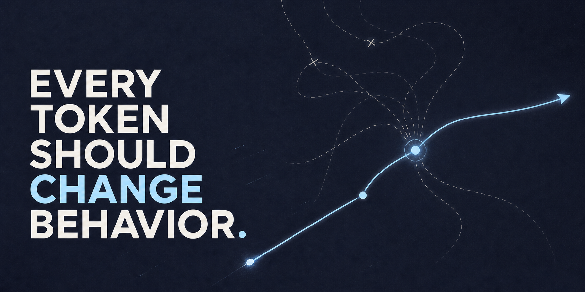

<h1>Astro Skills <sub><a href="README.zh.md">中文</a></sub></h1>



## Every token should change behavior.

Small skills that help coding agents make better decisions: clarify before building, prove before fixing, verify before accepting, and close the loop before stopping.

## Why I made these

I started with [Superpowers](https://github.com/obra/superpowers). It showed me how much a structured workflow can improve agentic coding. But I also found its full spec → plan → development process too heavy for much of my daily work. Even a change of a few lines could pull in the whole ceremony.

Then I found Matt Pocock's [`grill-me`](https://github.com/mattpocock/skills/tree/main/skills/productivity/grill-me). It was strikingly short, yet it changed the conversation in exactly the right place. That was the lesson: a skill is not valuable because it says more. It is valuable when a small instruction reliably changes an important behavior.

Astro Skills grew from that standard. I keep only the constraints that earn their place in the model's context—one recurring failure, one behavioral correction, as few tokens as the job allows.

## The skills

| Skill | Without it | With it |
| --- | --- | --- |
| [`goal-writer`](skills/goal-writer/) | A long-running task starts from vague intent and has no reliable finish line. | It becomes a bounded execution contract with concrete evidence, stop conditions, and human gates. |
| [`shape`](skills/shape/) | The agent starts building while material design decisions remain hidden. | It walks the design tree with you, resolving one consequential branch at a time. |
| [`debug`](skills/debug/) | The agent patches the first plausible cause. | It establishes a repeatable signal and uses discriminating evidence before claiming a root cause. |
| [`tdd`](skills/tdd/) | Tests are written after the implementation and prove little. | The agent watches the predicted RED, writes the minimum GREEN, then refactors safely. |
| [`review-feedback`](skills/review-feedback/) | Review comments are treated as instructions. | Each claim is verified, then fixed, deferred, simplified, or rejected at the right owner. |
| [`parallel-research`](skills/parallel-research/) | Multiple researchers repeat the same search and multiply confidence, not evidence. | They investigate independent angles while the main agent checks conflicts and decision-critical claims. |
| [`wrap-up`](skills/wrap-up/) | The session ends with a summary but leaves its own loose ends behind. | The agent verifies the outcome, cleans its footprint, and reports the actual final state. |
| [`learn-anything`](skills/learn-anything/) | A clear explanation creates the feeling of learning. | Retrieval, application, and teach-back build understanding the learner can actually use. |

`shape` is the clearest example of the design. Its core is a **design tree**: whenever a branch would materially change the outcome, the agent discusses that branch with the user instead of silently choosing. When the decision is genuinely visual, it renders the alternatives in HTML because seeing them is more useful than describing them.

## Install

Install all skills:

```bash
npx skills add Astro-Han/skills
```

Or install one:

```bash
npx skills add Astro-Han/skills --skill shape
```

See the [Skills CLI documentation](https://skills.sh/docs) for supported agents and other options.

## The rule

- Start with a failure agents actually repeat.
- Find the smallest instruction that changes that behavior.
- Keep evidence and observable outcomes; remove ceremony.
- Test demanding skills with smaller models when practical. If the skill only works because the base model is strong, the skill has not proved much.

Every line competes for limited context. If removing it does not make the agent worse at the job, it does not belong in the skill.

## Origins and acknowledgements

- `learn-anything` and `wrap-up` are original skills developed from my own workflows.
- `shape` is inspired by Matt Pocock's [`grill-me`](https://github.com/mattpocock/skills/tree/main/skills/productivity/grill-me). Its visual-decision rule also carries forward an idea from Superpowers' [`brainstorming`](https://github.com/obra/superpowers/tree/main/skills/brainstorming) workflow.
- `tdd` is inspired by Matt Pocock's [`tdd`](https://github.com/mattpocock/skills/tree/main/skills/engineering/tdd).
- `debug` draws from Matt Pocock's [`diagnosing-bugs`](https://github.com/mattpocock/skills/tree/main/skills/engineering/diagnosing-bugs), Superpowers' [`systematic-debugging`](https://github.com/obra/superpowers/tree/main/skills/systematic-debugging), and Waza's [`hunt`](https://github.com/tw93/Waza/tree/main/skills/hunt). It deliberately reduces those approaches to a smaller evidence-driven core.
- `review-feedback` began with ideas from Superpowers' [`receiving-code-review`](https://github.com/obra/superpowers/tree/main/skills/receiving-code-review), but has since been substantially rewritten around evidence, ownership, scope, and system cost.

The linked projects remain the canonical sources for their skills. This repository contains my own adaptations, not vendored copies. The English `SKILL.md` files are the canonical instructions for Astro Skills.

## License

MIT
