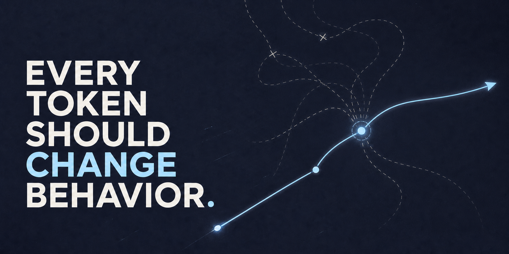

# Astro Skills

English | [中文](README.zh.md)



## Every token should change behavior.

Small skills that help coding agents make better decisions: clarify before building, prove before fixing, verify before accepting, and close the loop before stopping.

## Why I made these

I started with [Superpowers](https://github.com/obra/superpowers). It showed me how much a structured workflow can improve agentic coding. But I also found its full spec → plan → development process too heavy for much of my daily work. Even a change of a few lines could pull in the whole ceremony.

Then I found Matt Pocock's [`grill-me`](https://github.com/mattpocock/skills/tree/main/skills/productivity/grill-me). It was strikingly short, yet it changed the conversation in exactly the right place. That was the lesson: a skill is not valuable because it says more. It is valuable when a small instruction reliably changes an important behavior.

Astro Skills grew from that standard. I keep only the constraints that earn their place in the model's context—one recurring failure, one behavioral correction, as few tokens as the job allows.

## The skills

| Skill | Use it when | What you get |
| --- | --- | --- |
| [`goal-writer`](skills/goal-writer/) | You have an ambitious or long-running task, but the finish line is still vague. | A minimal execution contract that states the observable result, its acceptance criterion, and only the boundaries the task truly needs. |
| [`shape`](skills/shape/) | Material branches of a decision tree remain unresolved, and choosing silently would change the outcome. | A shared plan you have actually agreed on, reached one consequential branch at a time. |
| [`craft-skill`](skills/craft-skill/) | You want to create or improve a reusable agent skill and need to know whether its instructions earn their context. | A platform-valid skill shaped through Call and Steer, with every token, evaluation, and line of code held to Earn. |
| [`parallel-research`](skills/parallel-research/) | A high-cost question needs broad, current, trustworthy evidence. | A faster, better-supported answer: independent evidence angles run in parallel, then the main agent cross-checks critical claims and conflicts. |
| [`learn-anything`](skills/learn-anything/) | You want to genuinely learn or practise something, not just receive an explanation. | Adaptive coaching that uses retrieval, application, and teach-back to build understanding you can actually use. |
| [`explain-visually`](skills/explain-visually/) | A topic needs a picture-first explanation for someone who knows nothing about it. | Big visuals and few words through the available visual tool, with HTML only as fallback. |
| [`tdd`](skills/tdd/) | You are adding or changing production behavior and need fast, trustworthy feedback. | Small, verified increments: one predicted RED, the minimum GREEN, then safe refactoring before the next behavior. |
| [`debug`](skills/debug/) | A bug or performance regression needs investigation, not a plausible guess. | A reproducible signal, discriminating evidence, and a root cause checked against the original symptom. |
| [`simplify-audit`](skills/simplify-audit/) | An existing codebase carries complexity that nobody has proved is still needed. | An audit of what can actually disappear: every removal backed by a demand chain and a stated net reduction, leads that are not yet proved reported separately instead of dressed up as conclusions. |
| [`review-feedback`](skills/review-feedback/) | Code-review feedback may lead to changes and needs to be evaluated before acting. | An evidence-backed decision for every claim—fix, simplify, defer, or reject it at the layer that actually owns the problem. |
| [`pr-review`](skills/pr-review/) | You need to review one pull request or triage a review queue. | A review that first proves the problem and scope, then checks production ownership, the full diff, and only reachable P0–P3 findings. |
| [`wrap-up`](skills/wrap-up/) | The work is ending and you want the result finished, not merely summarized. | A closed workstream: promised outcomes verified, session-owned loose ends resolved, and the real final state reported. |

`shape` is the clearest example of the design. Its core is a **decision tree**: whenever a branch would materially change the outcome, the agent discusses that branch with the user instead of silently choosing. When the decision is genuinely visual, it shows faithful alternatives with the available representation closest to the intended product, preferring rendered HTML for interfaces, because seeing them is more useful than describing them.

## Evals

`evals/` contains executable paired comparisons for `tdd`, `debug`, `review-feedback`, and
`pr-review`. Its fixtures stand in for real work; the shared runner preserves each arm's artifacts,
and the grader records predeclared expectations. Evaluation coverage is explicit rather than implied
for every skill. See the [shared harness](evals/README.md) and its per-skill evaluation records.

## Install

### GitHub CLI

With [GitHub CLI](https://cli.github.com/manual/gh_skill_install) v2.90.0 or later, install all skills for Codex:

```bash
gh skill install Astro-Han/skills --all --agent codex --scope user
```

Or install one:

```bash
gh skill install Astro-Han/skills shape --agent codex --scope user
```

Replace `codex` with your agent host, or use `--scope project` for a repository-local installation.

### Skills CLI

Install all skills:

```bash
npx skills add Astro-Han/skills
```

Or install one:

```bash
npx skills add Astro-Han/skills --skill shape
```

See the [Skills CLI documentation](https://skills.sh/docs) for supported agents and other options.

## The rule

- Start with a failure agents actually repeat.
- Find the smallest instruction that changes that behavior.
- Keep evidence and observable outcomes; remove ceremony.
- Test demanding skills with smaller models when practical. If the skill only works because the base model is strong, the skill has not proved much.

Every line competes for limited context. If removing it does not make the agent worse at the job, it does not belong in the skill.

## Origins and acknowledgements

- `learn-anything` and `wrap-up` are original skills developed from my own workflows. `explain-visually` adapts Thariq Shihipar's [`eli5`](https://github.com/anthropics/claude-plugins-community/tree/main/eli5), keeping its big-pictures, few-words behavior while preferring the environment's native visual tools before HTML.
- `craft-skill` draws from [OpenAI's `skill-creator`](https://github.com/openai/skills/tree/main/skills/.system/skill-creator), [Anthropic's `skill-creator`](https://github.com/anthropics/claude-plugins-official/tree/main/plugins/skill-creator), Matt Pocock's [`writing-great-skills`](https://github.com/mattpocock/skills/tree/main/skills/productivity/writing-great-skills), and Superpowers' [`writing-skills`](https://github.com/obra/superpowers-skills/tree/main/skills/meta/writing-skills). It rebuilds their strongest ideas around three constraints: call the right skill, steer the agent to genuine completion, and make every token earn its place.
- `shape` is inspired by Matt Pocock's [`grilling`](https://github.com/mattpocock/skills/tree/main/skills/productivity/grilling). Its visual-decision rule also carries forward an idea from Superpowers' [`brainstorming`](https://github.com/obra/superpowers/tree/main/skills/brainstorming) workflow.
- `tdd` is inspired by Matt Pocock's [`tdd`](https://github.com/mattpocock/skills/tree/main/skills/engineering/tdd).
- `debug` draws from Matt Pocock's [`diagnosing-bugs`](https://github.com/mattpocock/skills/tree/main/skills/engineering/diagnosing-bugs), Superpowers' [`systematic-debugging`](https://github.com/obra/superpowers/tree/main/skills/systematic-debugging), and Waza's [`hunt`](https://github.com/tw93/Waza/tree/main/skills/hunt). It deliberately reduces those approaches to a smaller evidence-driven core.
- `simplify-audit` is a rewrite of [M4n5ter's `simplify-audit`](https://github.com/M4n5ter/skills/tree/main/simplify-audit), rebuilt around a suspicion-first posture, an asymmetric burden of proof, and three tiers named for what is still missing before a concept can disappear — nothing, one fact, or one decision — so a high-signal lead stays alive when the only gap is a fact the repository cannot reach. Two hunting grounds—hand-rolled infrastructure a maintained dependency already provides, and defensive copying or duplicated lifecycle state—come from DeepSeek's [`dsh-find-simplifications`](https://github.com/deepseek-ai/deepseek-harness/tree/master/.agents/skills/dsh-find-simplifications).
- `review-feedback` began with ideas from Superpowers' [`receiving-code-review`](https://github.com/obra/superpowers/tree/main/skills/receiving-code-review), but has since been substantially rewritten around evidence, ownership, scope, and system cost.

The linked projects remain the canonical sources for their skills. This repository contains my own adaptations, not vendored copies. The English `SKILL.md` files are the canonical instructions for Astro Skills.

## License

MIT
