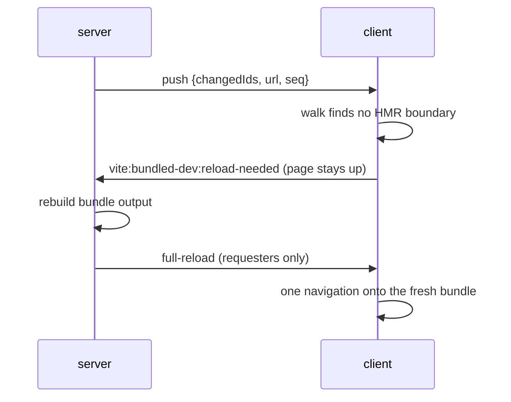

# Frozen pull request snapshot

- PR: https://github.com/vitejs/vite/pull/23106 — `feat(bundled-dev): reload once after rebuild instead of via the fallback page`
- Author: h-a-n-a
- Target base head: `fa005d19af5d847931c6dbefc63841c137383e6c`
- Comparison base: `fa005d19af5d847931c6dbefc63841c137383e6c`
- Exact source head: `159b9b9c635a586ad3c93f43473f62142ceecaf9`
- Diff: 111 additions, 5 deletions, 5 files
- Live mergeability and review state: intentionally unavailable in this historical fixture

## Pull request body

### Description

In bundled dev, when an HMR update has no boundary, the client reloads the page. Today it reloads immediately: the rebuilt bundle does not exist yet, so the browser lands on the "Bundling in progress" fallback page and reloads a second time when the bundle is ready. Two navigations, with a visible spinner page between them.

As discussed with @sapphi-red: the client now reports its decision to the server instead of navigating. The server rebuilds the bundle first, then answers with `full-reload`. One navigation, straight onto the fresh bundle, and the fallback page no longer appears in the HMR flow.

Concrete example: edit an entry module that nothing accepts (`main.js`). The client walk finds no boundary and the flow is now:

How it works:

- **Client:** every reload decision funnels through `requestFullReload`. It now sends `vite:bundled-dev:reload-needed { reason }` once and stops applying further updates — the page is about to navigate. The navigation itself is the ordinary `full-reload` payload handling.
- **Server:** a new handler records the requesting client and calls `ensureLatestBuildOutput()`. Once the output is stored, it sends `full-reload` to the requesters only. Tabs that hot-applied the same patch are not reloaded (the previous completion reload was a broadcast).
- **Failed builds:** the request stays armed. Reloading during a failed build would navigate onto the last good bundle, and the change that triggered the reload would never arrive — the healing edit only ships a patch for its own files. Instead the error overlay stays on the still-open page, and the next successful build serves the reload.
- **Terminal:** `bundling for page reload <reason>` at request time and `page reload` when it is sent, replacing the information the fallback page used to show in the browser.
- The fallback page still exists where there is no page to keep showing: the initial build, and a manual refresh while output is stale.

Known limits:

- An edit landing between "reload sent" and the browser's document request can still hit the fallback page. This race existed before and is much narrower now.
- Not covered by e2e yet: the requester-only behavior with two tabs, and the failed-build path (it needs an output-stage failure, which playground fixtures cannot trigger deterministically).

### Tests

- New spec in `playground/hmr-full-bundle-mode`: one document load, no fallback document, and the server-side `bundling for page reload` log after a no-boundary edit. The log assertion is the discriminating check — on a small fixture the old flow can also finish rebuilding before the reload request arrives, so navigation counts alone pass on both behaviors. Verified to fail against the previous behavior and pass with this change.
- `playground/hmr-full-bundle-mode`: 19 passed, 1 pre-existing skip.
- Full `pnpm run test-serve-bundled`: 56 files / 333 tests passed.

🤖 Generated with [Claude Code](https://claude.com/claude-code)

## Linked issues

No closing Issue was linked in the frozen PR metadata.

## Exact-head checks

- preview: SKIPPED
- preview: SKIPPED
- preview: SKIPPED
- Get changed files: SUCCESS
- Get changed files: SUCCESS
- Analyze (actions): SUCCESS
- Semantic Pull Request: SUCCESS
- Run zizmor: SUCCESS
- Lint: node-24, ubuntu-latest: SUCCESS
- Lint: node-24, ubuntu-latest: SUCCESS
- Build&Test: node-20, ubuntu-latest: SUCCESS
- Build&Test: node-20, ubuntu-latest: SUCCESS
- Build&Test: node-22, ubuntu-latest: SUCCESS
- Build&Test: node-22, ubuntu-latest: SUCCESS
- Build&Test: node-24, ubuntu-latest: FAILURE
- Build&Test: node-24, ubuntu-latest: SUCCESS
- Build&Test: node-26, ubuntu-latest: SUCCESS
- Build&Test: node-26, ubuntu-latest: SUCCESS
- Build&Test: node-24, macos-latest: SUCCESS
- Build&Test: node-24, macos-latest: SUCCESS
- Build&Test: node-24.15.0, windows-latest: SUCCESS
- Build&Test: node-24.15.0, windows-latest: SUCCESS
- Build & Test Passed or Skipped: SKIPPED
- Build & Test Passed or Skipped: SUCCESS
- Build & Test Failed: SKIPPED
- Build & Test Failed: SUCCESS
- Header rules - vite-docs-main: NEUTRAL
- Pages changed - vite-docs-main: NEUTRAL
- Redirect rules - vite-docs-main: NEUTRAL
- CodeQL: SUCCESS
- zizmor: SUCCESS
- Graphite / AI Reviews: SUCCESS
- unnamed: SUCCESS

## Changed files

- `packages/vite/src/client/bundledDevClient.ts`: +0/-2
- `packages/vite/src/client/bundledDevHmrClient.ts`: +11/-3
- `packages/vite/src/node/server/bundledDev.ts`: +50/-0
- `packages/vite/types/customEvent.d.ts`: +2/-0
- `playground/hmr-full-bundle-mode/__tests__/hmr-full-bundle-mode.spec.ts`: +48/-0
